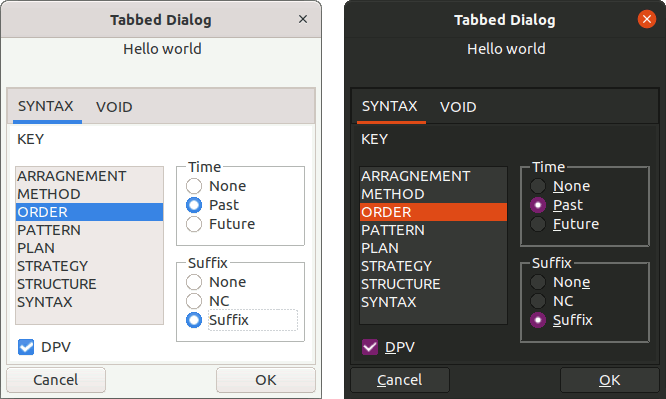

# TAB CONTROL DIALOG BOX

LibreOffice do not a Tab Control in the macro editor.
However LibreOffice does have a [Tab Container](<https://api.libreoffice.org/docs/idl/ref/servicecom_1_1sun_1_1star_1_1awt_1_1tab_1_1UnoControlTabPageContainerModel.html>) built in.

This example demonstrates how to use Tabs in a Dialog Box.

Example is created in [MVC](https://en.wikipedia.org/wiki/Model%E2%80%93view%E2%80%93controller) style.

Example also demonstrates usage of [Radio Button](https://api.libreoffice.org/docs/idl/ref/servicecom_1_1sun_1_1star_1_1awt_1_1UnoControlRadioButton.html) Controls and [List Box](https://api.libreoffice.org/docs/idl/ref/servicecom_1_1sun_1_1star_1_1awt_1_1UnoControlListBox.html) controls.



## Sample Document

see sample LibreOffice Writer document, [tab_dialog.odt](tab_dialog.odt)

### Sample Code

see [script.py](script.py) for sample usage.

## Usage

```python
from src.examples.tab_dialog.mvc.controller import MultiSyntaxController
from src.examples.tab_dialog.mvc.model import MultiSyntaxModel
from src.examples.tab_dialog.mvc.view import MultiSyntaxView


dlg = MultiSyntaxController(model=MultiSyntaxModel(), view=MultiSyntaxView())
dlg.start()

```

## Events

Events are attached to the various components, when an event fires the controller is updated.

For instance [XItemListener](https://api.libreoffice.org/docs/idl/ref/interfacecom_1_1sun_1_1star_1_1awt_1_1XItemListener.html) are attached to List box clicks.

[XPropertyChangeListener](https://api.libreoffice.org/docs/idl/ref/interfacecom_1_1sun_1_1star_1_1beans_1_1XPropertyChangeListener.html) are attached to Radio buttons.

## Source

see [mvc](mvc)
